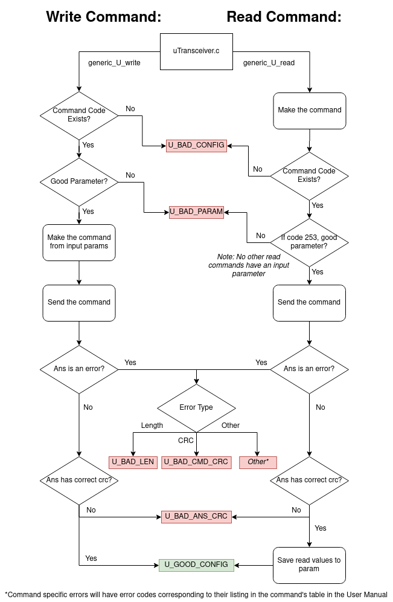

# RF Command Generator
1. Add desired commands to main.c.
2. Run make from the root directory.
3. Run ./uhf_commands, which outputs binary data to stdout. Use pipe or file operator as desired.
4. Done!

# UHF Transceiver Equipment Handler
The EnduroSat UHF Transceiver type II is a half-duplex transceiver we will be using for downlinking housekeeping data and uplinking commands. The code in this repository follow's EnduroSat's command format to allow us to read and write parameters and collect housekeeping data from the board. I2C and UART communications have been mocked using CMock. Functions implemented here are also listed in the ["S-Band and 
UHF Functions List" spreadsheet](https://docs.google.com/spreadsheets/d/1zNhxhs0KJCp1187Vm3-zAzQHCY31f77l-0nlQmfXu1w/edit#gid=565953736) on the drive. Refer to that for details about input/output.

## Ceedling Build Instructions
First, [install Ceedling](https://github.com/ThrowTheSwitch/Ceedling). Then run:
```
git clone https://github.com/AlbertaSat/ex2_uhf_software
cd ex2_uhf_software/CommsSim
ceedling
```
The above instructions should run all unit tests of the UHF Transceiver Equipment Handler

## Error Reporting


